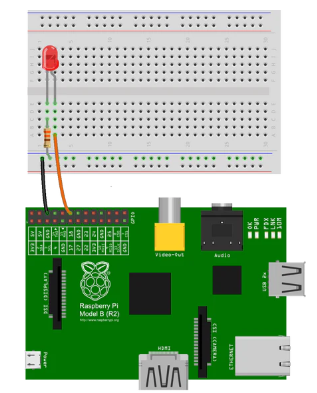

## Hardware setup

-   LED
-   330Ω resistor
-   Raspberry Pi 4B running
    [Ubuntu Server 20.04.5 LTS](https://cdimage.ubuntu.com/releases/20.04.5/release/)
-   Ethernet cable

Connect them as below:



then, connect ethernet cable to the Raspberry Pi, or
[set up WiFi](https://huobur.medium.com/how-to-setup-wifi-on-raspberry-pi-4-with-ubuntu-20-04-lts-64-bit-arm-server-ceb02303e49b).

## (Pi) build lighting GPIO application

### 1. install and prepare build environment

Install:

```
git clone https://github.com/MonicaisHer/connectedhomeip.git
cd connectedhomeip/
git checkout lighting-app-rpi-gpio

# Remove unused large submodules
git rm third_party/bouffalolab/repo # 7G
git rm third_party/mbed-os/repo
git rm third_party/ti_simplelink_sdk/repo_cc13xx_cc26xx
git rm third_party/ti_simplelink_sdk/repo_cc32xx
git rm third_party/silabs/matter_support
git rm third_party/silabs/gecko_sdk
git rm third_party/silabs/wiseconnect-wifi-bt-sdk

# Keep only used python packages
cp scripts/requirements.txt scripts/requirements.txt.bak
grep -E "click|lark|stringcase" scripts/requirements.txt.bak > scripts/requirements.txt
```

Setup tool chain:

```
sudo apt-get update

sudo apt-get install git gcc g++ pkg-config libssl-dev libdbus-1-dev \
  libglib2.0-dev libavahi-client-dev ninja-build python3-venv python3-dev \
  python3-pip unzip libgirepository1.0-dev libcairo2-dev libreadline-dev -y

sudo apt-get install python-is-python3 -y

sudo reboot
```

### 2. build

Build [wiringPi](https://github.com/WiringPi/WiringPi) library:

```
git clone https://github.com/WiringPi/WiringPi --branch master --single-branch wiringpi
cd ~/wiringpi
sudo ./build
```

The `BUILD.gn` file has been modified to have `wiringPi` lib linker.

Build:

```
source ~/connectedhomeip/scripts/activate.sh
# Depending on the machines, this step may take some time

cd ~/connectedhomeip/examples/lighting-app/linux/
gn gen out/build
ninja -C out/build
```

## (Pi) Run lighting GPIO application

```
sudo ./out/build/chip-lighting-app --wifi
```

## (Laptop) Pair the lighting GPIO application over WiFi

Build chip-tool as a Matter controller:

```
git clone https://github.com/MonicaisHer/connectedhomeip.git
cd connectedhomeip

# Remove unused large submodules
git rm third_party/bouffalolab/repo # 7G
git rm third_party/mbed-os/repo
git rm third_party/ti_simplelink_sdk/repo_cc13xx_cc26xx
git rm third_party/ti_simplelink_sdk/repo_cc32xx
git rm third_party/silabs/matter_support
git rm third_party/silabs/gecko_sdk
git rm third_party/silabs/wiseconnect-wifi-bt-sdk

# Keep only used python packages
cp scripts/requirements.txt scripts/requirements.txt.bak
grep -E "click|lark|stringcase" scripts/requirements.txt.bak > scripts/requirements.txt

# Comment out the activation command from build script
sed '/activate.sh/s/^/#/' scripts/examples/gn_build_example.sh
```

```
./scripts/examples/gn_build_example.sh examples/chip-tool .
```

Run chip-tool:

```
sudo ./chip-tool pairing onnetwork 123 20202021
# 123: an user defined node id
# 20202021: lighting-gpio-app setup pin code
```

Check chip-lghting-app logs:

```
...
CHIP:SVR: Commissioning completed successfully
...
```

Check chip-tool logs:

```
...
CHIP:TOO: Device commissioning completed with success
...
```

## (Laptop) Control the lighting GPIO application

```
sudo ./chip-tool onoff toggle 0x000000000000007B 1
# 0x7B = 123
```

You should see the LED could be turned on/off now.
